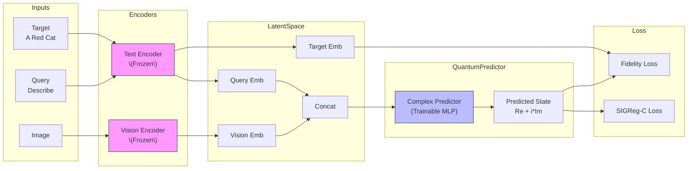
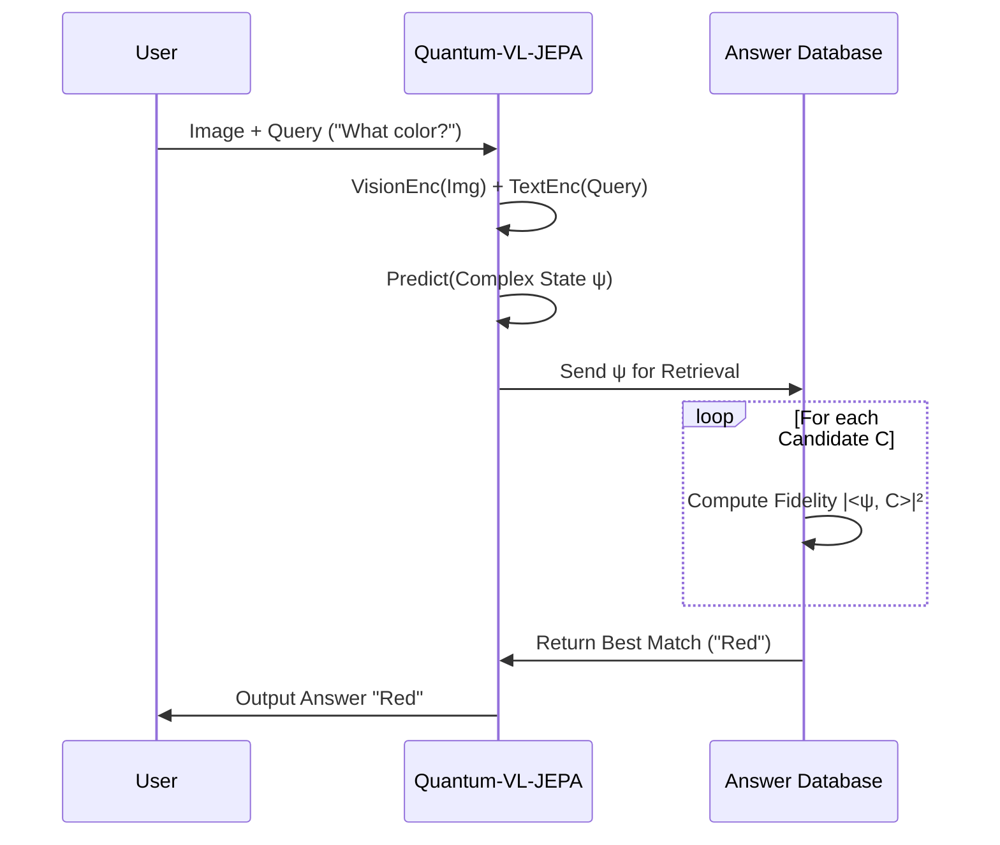

# Quantum-VL-JEPA Architecture

**Quantum-VL-JEPA** is a multimodal predictive architecture that fuses **Vision-Language (VL)** understanding with **Quantum-Inspired Latent Dynamics**.

It is designed to solve the problem: _Given an image and a text query, what is the answer/caption?_
Instead of generating text token-by-token (Generative), it predicts the **Complex Probability Amplitude** of the answer in an abstract semantic space (JEPA).

---

## 🏗️ Core Components

### 1. Vision Encoder ($X_V$)

- **Model**: `ViT-Small/16` (timm `vit_small_patch16_224`)
- **Role**: Maps raw pixels to a semantic real-valued vector.
- **State**: Frozen (Production/Efficiency) or Finetuned.
- **Output**: $\mathbf{x}_v \in \mathbb{R}^{384}$

### 2. Text/Query Encoder ($X_Q$ & $Y$)

- **Model**: `Sentence-BERT` (`all-MiniLM-L6-v2`)
- **Role**: Maps text queries ("Describe this") and targets ("A red cat") to semantic vectors.
- **State**: Frozen.
- **Output**: $\mathbf{x}_q, \mathbf{y} \in \mathbb{R}^{384}$

### 3. Complex Predictor ($P_\theta$)

- **Model**: Multi-Layer Perceptron (MLP) with LayerNorm & GELU.
- **Input**: Concatenation of Vision and Query $[\mathbf{x}_v; \mathbf{x}_q]$.
- **Output**: A **Complex Vector** $\hat{\psi} = \text{Re}(\hat{\psi}) + i \cdot \text{Im}(\hat{\psi})$.
- **Role**: Predicts the "Quantum State" of the answer.
- **Why Complex?**: Allows modeling interference, phase relationships, and non-commutative logic often found in cognitive reasoning (A then B $\neq$ B then A).

---

## 🧠 Training Flow (The "Forward Pass")

1. **Encode Inputs**:
   $$ \mathbf{x}\_v = \text{Enc}\_V(\text{Image}) $$
   $$ \mathbf{x}\_q = \text{Enc}\_T(\text{Query}) $$

2. **Predict Complex State**:
   $$ \hat{\psi} = \text{Predictor}([\mathbf{x}_v; \mathbf{x}_q]) $$
   $$ \hat{\psi} \in \mathbb{C}^{384} $$

3. **Encode Target** (During Training Only):
   $$ \mathbf{y} = \text{Enc}\_T(\text{True Answer}) $$
   (Treat $\mathbf{y}$ as a complex vector with zero imaginary part for alignment).

---

## 📉 Loss Functions

The model optimizes a joint objective $L = L_{\text{fidelity}} + \alpha L_{\text{SIGReg-C}}$.

### 1. Quantum Fidelity Loss ($L_{\text{align}}$)

Maximizes the overlap between the predicted quantum state and the true target state.
$$ F = \left| \frac{\langle \hat{\psi}, \mathbf{y} \rangle}{||\hat{\psi}|| \cdot ||\mathbf{y}||} \right|^2 $$
$$ L\_{\text{align}} = 1 - F $$
This is mathematically equivalent to Cosine Similarity in complex space but motivated by quantum measurement probability (Born Rule).

### 2. SIGReg-C (Complex Isotropy)

Prevents "Representation Collapse" (where the model outputs the same constant vector for everything).
Inspired by **LeJEPA (2025)**.

- Forces Real and Imaginary parts to have **Unit Variance**.
- Forces features to be **Decorrelated** (Orthogonal information).
  $$ L\_{\text{SIGReg}} = \text{VarLoss}(\text{Re}(\hat{\psi})) + \text{VarLoss}(\text{Im}(\hat{\psi})) $$

---

## 🚀 Inference (How to use it)

Unlike GPT, this model does not output text. It outputs a **vector**.
To get an answer:

1. Run Model(Image, Query) $\rightarrow \hat{\psi}_{\text{pred}}$.
2. Have a database of candidate answers (e.g., "Yes", "No", "Red", "Blue").
3. Encode candidates $\rightarrow \mathbf{y}_1, \mathbf{y}_2, ...$
4. Compute Fidelity $|\langle \hat{\psi}_{\text{pred}}, \mathbf{y}_k \rangle|^2$ for all candidates.
5. Pick the one with highest fidelity.

---

## 📊 File Structure

- `src/vyom_jepa/models/quantum_vl_jepa.py`: The architecture definition.
- `src/vyom_jepa/losses/quantum_losses.py`: Fidelity and SIGReg implementation.
- `src/train_vl.py`: Training loop for this specific architecture.
